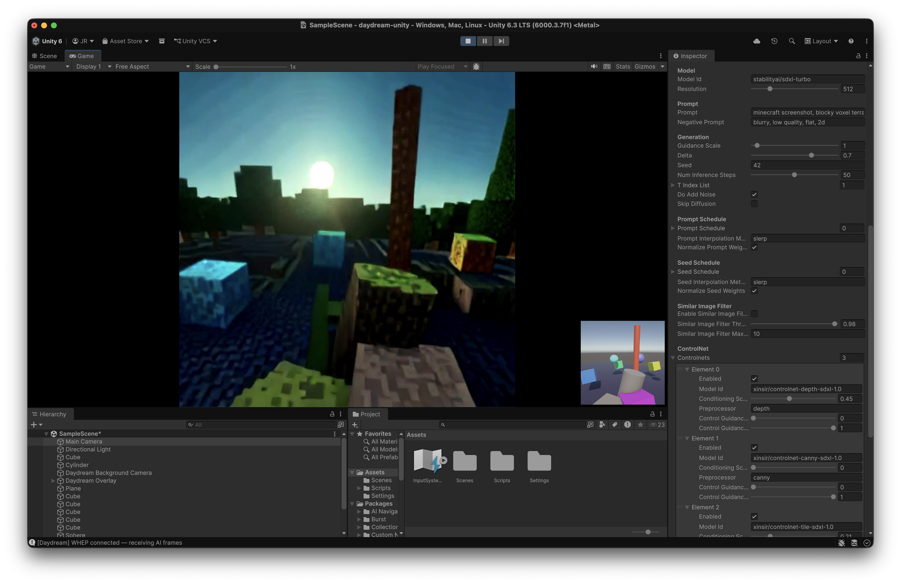

# Daydream for Unity



A real-time AI video processing plugin for Unity. Apply live generative AI effects to your camera using diffusion models powered by [Daydream](https://daydream.live).

## Features

- Real-time AI image-to-image transformation via WebRTC
- Multiple prompt scheduling with weighted interpolation
- ControlNet support (depth, canny, tile, and more)
- IP-Adapter for image-guided generation
- Low-latency streaming (WHIP/WHEP)
- Works with URP, HDRP, and Built-in render pipelines

## Requirements

- Unity 6 (6000.x)
- [com.unity.webrtc](https://docs.unity3d.com/Packages/com.unity.webrtc@3.0) 3.0.0
- A [Daydream](https://daydream.live) account

## Installation

Open **Window > Package Manager**, click **+** > **Add package from git URL...**, and enter:

```
https://github.com/livepeer/daydream-unity.git
```

Also install the [WebRTC package](https://docs.unity3d.com/Packages/com.unity.webrtc@3.0) if not already present.

## Usage

1. Add the **Daydream** component to any Camera
2. Enter your API Key in the Inspector
3. Press **Play**

The camera output is sent to the Daydream API for AI transformation, and the result is displayed as a fullscreen overlay. A picture-in-picture view shows the original camera feed.

## Configuration

All parameters are exposed in the Inspector on the **Daydream** component:

| Section | Parameters |
|---------|-----------|
| **Model** | Model ID, Resolution |
| **Prompt** | Prompt, Negative Prompt |
| **Generation** | Guidance Scale, Delta, Seed, Inference Steps, Step Schedule, Noise |
| **Prompt Schedule** | Weighted prompt entries, Interpolation method |
| **Seed Schedule** | Weighted seed entries, Interpolation method |
| **ControlNet** | Model, Conditioning Scale, Preprocessor per ControlNet |
| **IP Adapter** | Scale, Type, Weight Type, Style Image URL |
| **Display** | Overlay toggle, PIP toggle, PIP size |

### Accessing AI Output Programmatically

```csharp
var effect = GetComponent<Daydream>();
Texture aiOutput = effect.OutputTexture;
```

Set `showOverlay = false` to disable the built-in overlay and render the AI output on any surface.

## Demo

Import the **Demo Scene** sample from the Package Manager to get WASD + mouse camera controls and sample geometry for testing. Requires the [Input System](https://docs.unity3d.com/Packages/com.unity.inputsystem@1.18) package.

## License

See [LICENSE](LICENSE) for details.
